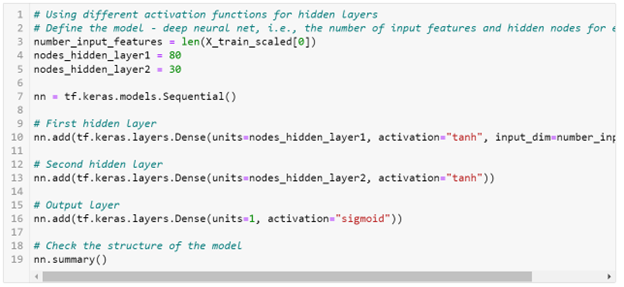

# Neural_Network_Charity_Analysis
Machine Learning and Neural Networks

## Overview
The purpose of this project is to use deep-learning neural networks with the TensorFlow platform in Python, to analyze and classify the success of charitable donations. The dataset contains over 34,000 organizations that have been funded by Alphabet Soup. There are a number of columns that capture the metadata of each organization such as application type, organization type, the effective use of funding, amongst others. 

I used the following steps for the analysis:
- Preprocessing the data for the neural network model,
- Compile, train and evaluate the model,
- Optimize the model.

## Results

### *Data Preprocessing*
- *What variable(s) are considered the target(s) for your model?*

The variable we are targeting in this module is the IS_SUCCESSFUL column.

- *What variable(s) are considered to be the features for your model?*

The following columns are the features for this model: APPLICATION_TYPE, AFFILIATION, CLASSIFICATION, USE_CASE, ORGANIZATION, STATUS, INCOME_AMT, SPECIAL_CONSIDERATIONS, ASK_AMT.

- *What variable(s) are neither targets nor features, and should be removed from the input data?*

The columns that are neither targers nor features and are removed from the input data are EIN and NAME because they represents identification information and have little to do with our outcome.

### *Compiling, Training, and Evaluating the Model*
- *How many neurons, layers, and activation functions did you select for your neural network model, and why?*

As shown in Fig. 1 below, this model is made with an input feature, two hidden layers, and an output layer. The first hidden layer has 80 neurons, while the second has 30 neurons. Each layer has an activation function: The first and second hidden layers have an activation function "relu" and the output layer has an activation function "sigmoid".

  
  

Fig.1 - Neural Network - Model 1

- *Were you able to achieve the target model performance?*

Using this neural network model, our accuracy was only 72.7% as shown in Fig. 2. Therefore, we did not achieve the target model performance of 75%. 

  
  

Fig.2 - Neural Network - Model 1: Loss/Accuracy Results

- *What steps did you take to try and increase model performance?*

Some of the steps I took to try and increase model performance were:
- Changing the number of neurons in each layer (Fig. 3 and Fig. 4)
- Changing the activation type (Fig. 5 and Fig. 6) 
- Adding a third hidden layer (Fig. 7 and Fig. 8)

  
  

Fig.3 - Neural Network - Model 2

  
  

Fig.4 - Neural Network - Model 2: Loss/Accuracy Results

  
  

Fig.5 - Neural Network - Model 3

  
  

Fig.6 - Neural Network - Model 3: Loss/Accuracy Results

  
  

Fig.7 - Neural Network - Model 4

  
  

Fig.8 - Neural Network - Model 4: Loss/Accuracy Results

## Summary
We started with a data set and tried to predict whether or not the project would be successful on all of the features that we used after dropping two features that we figured to be irrelevant. The model with the best accuracy ended up being Model 4, where we added a third hidden layer, which gave us an accuracy of 73.1% (as shown in Fig. 8 above). Although I did not get to the accuracy of 75% that I wanted, it is possible the reason for this is we may have had to drop more features which may have affected how good the neural network actually is. Additionally, we can see that each modifiction from the original neural network model did have some impact on the accuracy (see Fig. 4 and Fig. 6), so I could have made all of the above changes in one neural network model to see how that could further impact our model perfomance. 
